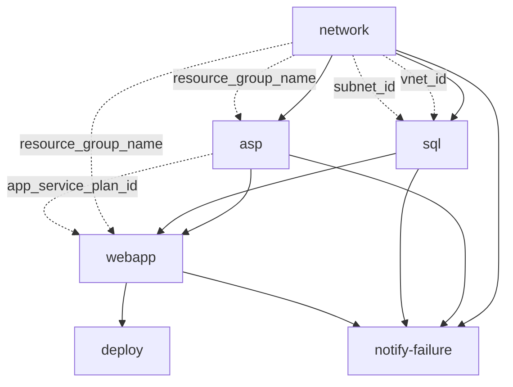

# Composition: asp-sql-webapp-comp

## Metadata
- **Workflow Name**: pavedpath-network-aspsql-webapp
- **Description**: Generated workflow with metadata and Terraform context
- **Deployment Environment**: dev
- **Region**: US East 2
- **Cost Center**: ABC123
- **Workspace Prefix**: lob1-dev
- **Deployment ID**: run-001
- **Composition Name**: asp-sql-webapp-comp
- **Tags**: sandbox, database, paved-path
- **Terraform Version**: 1.12.1
- **Execution Mode**: remote
- **Terraform Organization**: torc
- **Terraform API Endpoint**: https://app.terraform.io/api/v2
- **First Node**: network
- **Last Node**: webapp
- **Organization ID**: 2
- **Inventory ID**: 4

---

## Mermaid DAG (Execution Flow + I/O Dependencies)

> Solid lines represent DAG execution flow. Dashed lines indicate required output → input data dependencies.

---

## Patterns

### network
- **Order**: 1
- **Inputs**: None
- **Outputs**:
  - vnet_id
  - subnet_id
  - resource_group_name
- **Terraform**:
  - tfvars file: `terraform/network.auto.tfvars.json`
  - workspace: `network`
  - workspace ID: `ws-yoD5msACjiUYa9vV`
- **Job Template**: network-state

---

### asp
- **Order**: 2
- **Inputs**:
  - resource_group_name ← from `network`
- **Outputs**:
  - app_service_plan_id
- **Terraform**:
  - tfvars file: `terraform/asp.auto.tfvars.json`
  - workspace: `asp`
  - workspace ID: `ws-M3MYQw6giq8qYJAH`
- **Job Template**: asp-state

---

### sql
- **Order**: 2
- **Inputs**:
  - subnet_id ← from `network`
  - vnet_id ← from `network`
- **Outputs**:
  - sql_server_name
  - sql_admin_username
  - sql_admin_password
- **Terraform**:
  - tfvars file: `terraform/sql.auto.tfvars.json`
  - workspace: `sql`
  - workspace ID: `ws-3BaTLE29KaSSZAUs`
- **Job Template**: mssql-state

---

### webapp
- **Order**: 3
- **Inputs**:
  - app_service_plan_id ← from `asp`
  - resource_group_name ← from `network`
- **Outputs**:
  - web_app_id
- **Terraform**:
  - tfvars file: `terraform/webapp.auto.tfvars.json`
  - workspace: `webapp`
  - workspace ID: `ws-3cNA14YMTy9j7qTA`
- **Job Template**: webapp-state

---

### deploy
- **Job Template**: deploy-notification

---

### notify-failure
- **Job Template**: failure-notification
