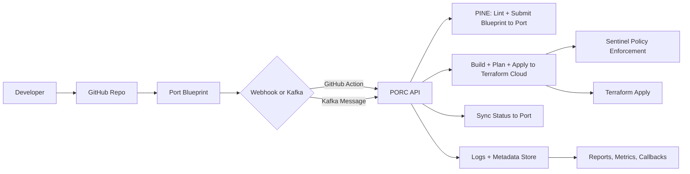

# PORC System Architecture

This document describes the architecture of the PORC platform orchestrator and how its components interact.

---

## Overview

PORC consists of:

- **PINE CLI**: Developer tool for linting and rendering Terraform files from blueprints
- **PORC API**: FastAPI backend for managing runs, uploads, and Terraform orchestration
- **Port**: Blueprint source and reporting interface
- **Terraform Enterprise**: Execution engine with Sentinel enforcement
- **GitHub**: CI/CD workflow trigger and feedback loop

---

## Mermaid Flow Diagram (Corrected)



```
Developer --> GitHub Repo --> Port Blueprint --> [Kafka or Webhook]
                                                  |
                                                  v
                                         +------------------+
                                         |      PORC API     |
                                         +------------------+
                                           |        |       |
                          /lint & render <-+        +-> /notify (Port)
                          |                        /plan + /apply (TFE)
                      +--------+                +----------------+
                      |  PINE  |<---------------+  Mongo/FS Store |
                      +--------+                +----------------+
```

---

## Key Flows

### Blueprint Ingestion
- Blueprint submitted from GitHub or Port
- Stored locally by PORC and assigned a `run_id`

### Rendering
- PINE is used to validate blueprint schema and submit it to Port
- Output files: `main.tf`, `terraform.tfvars.json`

### Execution
- PORC pushes files to Terraform Enterprise using remote workspaces
- Sentinel enforces policy before apply

### Reporting
- Status synced back to Port via Terraform provider
- GitHub Check Runs posted using commit SHA
- Logs written locally and exposed via `/logs` and `/report`

---

## Persistence and State

- Metadata: `/tmp/porc-metadata/{run_id}.json`
- Rendered files: `/tmp/porc-runs/{run_id}/`
- Logs: `/tmp/porc-logs/{run_id}.log.jsonl`

---

## Future Enhancements

- Replace FS with MongoDB or Postgres
- Replace Kafka/Webhooks with unified pub/sub event layer
- Add UI for reviewing plan/apply output and history

### Client–Server Design

- **PINE CLI**: Local developer interface (submit, build, plan, apply)
- **PORC API**: Validates blueprints, renders Terraform, interacts with TFE
- **TFE**: Executes plan and apply runs, enforces Sentinel policies
