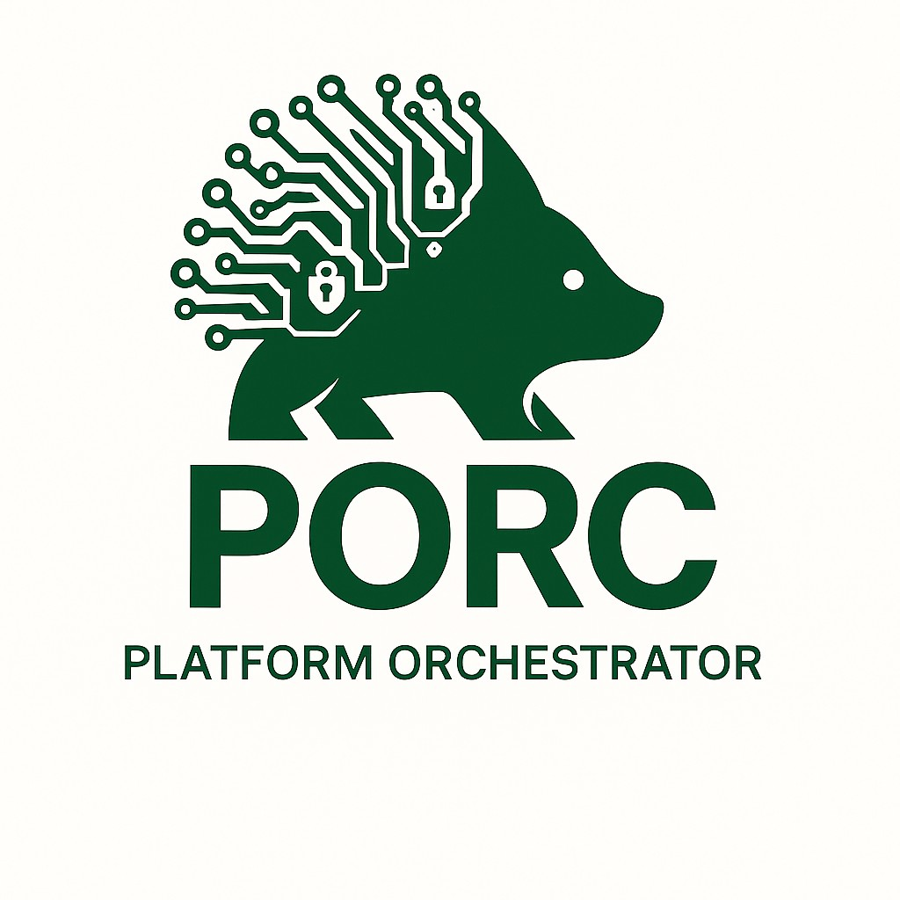

# PORC Documentation

Welcome to the PORC (Platform Orchestrator) documentation site. This directory contains all supporting markdown files for integrations, architecture, and usage guidance.
# Index

- [Backstage Integration](Backstage_Integration.md)
- [Port Integration](Port_Integration.md)
- [API Reference](API.md)
- [Approvals](Approvals.md)
- [Blueprint Security](Blueprint-Security.md)
- [Plan/Apply Flowchart](plan_apply_flowchart.md)
- [Sentinel Policies](Sentinel_Policy_Enforcement.md)
- [PINE CLI Usage](pine_cli.md)
- [PINE Usage Guide](pine_usage.md)

Refer to the root `README.md` for platform architecture and deployment instructions.