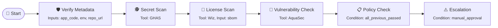

# 📄 PDC Contract: secure-deploy

## 📌 Metadata
- **Environment**: prod
- **Region**: us-east
- **Artifact**: webapp
- **Owner**: team-app

---

## 🛠️ Pipeline Type: `promotion`

### 🎯 Stages

#### 🔍 Verify
- **Description**: Metadata and repo hygiene
- **Gates**: `VerifyMetadata`, `SecretScan`

#### 🔐 Secure
- **Description**: License, SBOM, CVEs
- **Gates**: `LicenseScan`, `VulnCheck`

#### 🚀 Promote
- **Description**: Policy and manual approvals
- **Gates**: `PolicyCheck`, `Escalation`

---

## 🔗 Control Flow Diagram

---

## 🧩 Gate Definitions

### 🛡️ Verify Metadata
- **Inputs**: `app_code`, `env`, `repo_url`

### 🕵️ Secret Scan
- **Tool**: GitHub Advanced Security (GHAS)

### 📜 License Scan
- **Tool**: Wiz
- **Inputs**: `sbom`

### 🧪 Vulnerability Check
- **Tool**: AquaSec

### 📋 Policy Check
- **Condition**: `all_previous_passed`

### ⚠️ Escalation
- **Condition**: `manual_approval`
